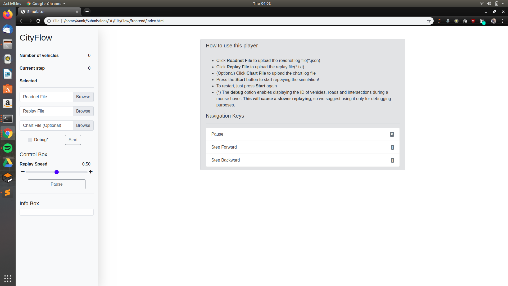
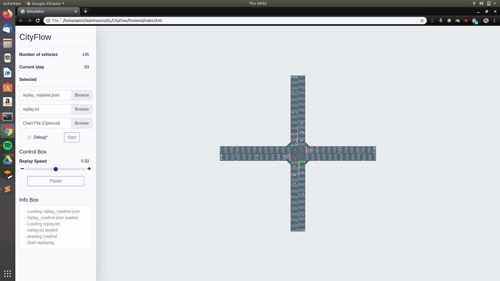
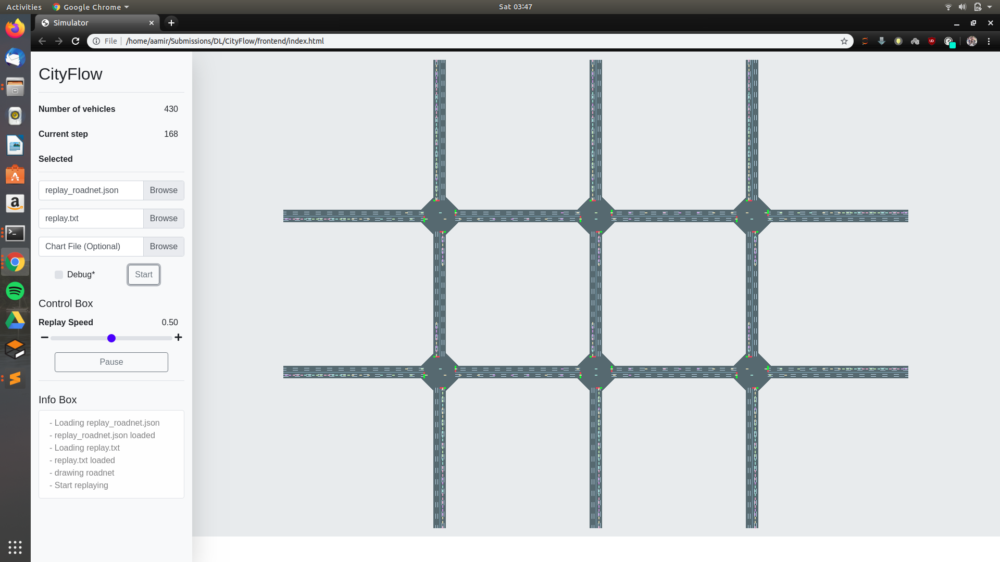

# DL_Project_VII_Sem
CityFlow Simulation - for 1x1 and 3x2 grid using multi agent reinforcement learning

Simulation and running done as part of the program for DL, Sem VII

### Credits to CityFlow: (https://github.com/cityflow-project/CityFlow)

## Screenshots:

- 
- 
- 
- 
